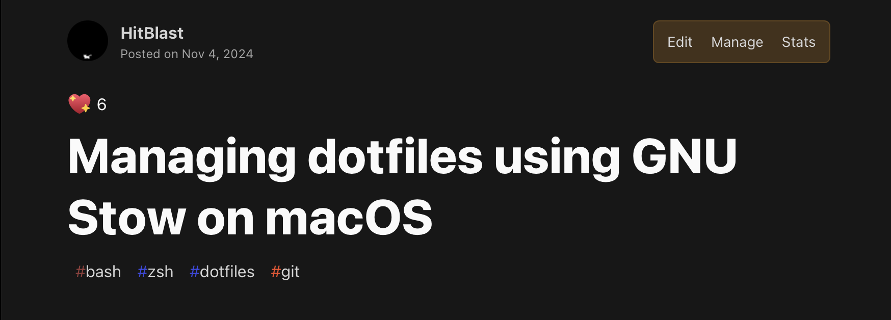

+++
title = "Shifting Blogs: Dev.to -> My Personal Blog"
date = 2025-05-17
description = "A brief look at my take of blogging as a proper method of journaling, the technical parts and some story to back it up."
authors = ["hitblast"]

[taxonomies]
tags = ["web", "pico-css", "zola"]
+++

### A little bit of backstory

So, to kick things off, I'd really like to mention that I like writing a lot aside of programming.

And by "writing", I don't really mean writing code- it's that pure afternoon or evening venting sessions we sometimes get with our own diaries. I've been writing since I was 12. I usually prefer to write in short bursts- longer hours were never my thing.

And to extend the description here, the least I can do is say "diaries were like an exhaust pipeline to my mind." Younger me would easily get distracted or overwhelmed by thoughts which would later turn out to be silly. But, what I did do right is that, I started writing as a commonplace for offloading my brain.

This went on for years, till I entered high school.

Writing was still a thing, except when it wasn't. Studies and the urge to do programming at that point became so much stronger than my journaling hobby that it was lost within years. It wasn't completely lost, however, as I tried to do what I'd like to annotate as **functional journaling**. During the last few months of my secondary exam, I would jot down every key detail I studied every day, which would later help me to reflect on my day. I wasn't really venting my emotions anymore, but all I was really doing is finding something for my mind to co-process with.

This all went on perfectly until a few incidents of my life led to me being extremely burnt out of things.

During my first year of college, I was really not feeling like programming, doing music or generally, *anything at all*. Emotional burnout had creeped its way in through a self-made backdoor which I was unable to retain from being closed. Eventually I had to also cut some of my closest "friends" to give myself a tiny breathing room for everything happening at that time.

When I was falling back to my hobbies after a period, I needed a way to channel my thoughts again - which was most definitely writing.

### Writing coding blogs

Now a matter of fact is that I still wasn't done with functional journaling *yet* - in fact the loss of writing as a second nature led to me believing solely on functional journaling- and nothing else. Luckily, I was also starting to maintain some of my larger projects again, which includes [**avro.py**](https://github.com/hitblast/avro.py), my largest Python library project till today. It gave me some room for recalibrating my projects. I was also **quitting [Visual Studio Code](https://code.visualstudio.com)** for switching to [**Zed**](https://zed.dev) since I wanted to make the most out of my computing gear without losing precious performance to bloatware. I was also learning to use dotfiles to store all of them in a single place.

While setting the configuration up, I thought to myself, "why not just document everything that I'm doing right now?" So, I started.

I couldn't really focus my mind to write at my house, so I grabbed my laptop and went to the closest restaurant.

Then, I ordered a meal and I started documenting my setup process from scratch.

Eventually, I ended up with this:

  

See: [**"Managing dotfiles using GNU Stow on macOS"**](https://dev.to/hitblast/managing-configuration-using-gnu-stow-on-macos-5ff6)

This was the literal revival of the habit which helped me for so long.

After I had finished laying off a draft markdown for the blog, I came home and posted it. After realizing that it wasn't much from a technical standpoint, but rather a lot of background offloading that was being done by my mind- I got motivated to do more.

Eventually I wrote down the setup procedure for my previous Zed setup in a blog too!

[**"How I configured the Zed editor for daily-driving"**](https://dev.to/hitblast/how-i-configured-the-zed-editor-for-daily-driving-4k2k)

Realizing the potential in combining functional journaling with actual blogs which could mean useful to a lot of other developers, I thought of creating a personal blog instead of solely depending on dev.to for it. I wanted to create a blog which would not be engaging in a prestructured way, but rather in a way that would actually mean writing was useful for both the reader and the writer.

### The halt

Eventually though, my second year came without a proper notice, and I was left with little space to think about what I'd write. Instead, I was busy teaching others about different programming concepts, theories, and just generally busy juggling between cultural festivals and procrastinating.

I was that same, dull situation, all over again, except that I wasn't really free anymore.

Still to this day, I'm struggling to balance my will and mind to keep a good momentum in both work and my studies.

### Recreating this domain

[hitblast.github.io](https//hitblast.github.io) has been my go-to personal domain from GitHub Pages for well over four years now. I'm used to constantly modifying it to my needs. I have been thinking about repurposing it as a personal x blog page in order to facilitate the need of a blog page.

This would come with some challenges, though:

- Since I don't plan to write any website using a bloated framework like Django, I would have to use **static site generation** to prebuild my websites before publishing.
- The change above would also need its separate CI/CD pipeline. For that I needed **GitHub Actions**.
- A general restructuring of my entire website since I was not "really satisfied" with its aesthetics.

Given the amount of hipster I am, I chose to base this website off of one of my earlier websites for my app studio "Stray Technologies". I used [this website](https://github.com/thestraytech/thestraytech.github.io) as a reference and extensively modified its styling to match my needs. To put in short, it acted as a boilerplate for the new website.

I also chose to reuse the workflow ([see source code](https://github.com/hitblast/hitblast.github.io/blob/main/.github/workflows/deploy.yml)) for automatically deploying the site to GitHub Pages. It would also mean changing my repository settings from "Deploy from a branch" to "GitHub Actions" since otherwise the page would be deployed for mere seconds before shutting down again. I *tried* using generative AI for repurposing some more boilerplate, but that turned out to be a problem of its own which I might write another blog about, so I rolled back.

And after all that, I finally got the website that you're reading this blog on as the end result.

The surprising part? All of this was done within only one-two hours of programming, and it's only now during the evening that I'm writing the first entry.

### Verdict

Though this blog shouldn't have been elongated, I personally found it relaxing to share the story in a detailed way without elaborating much on the tech side. I hope you will find this read enjoyable :3 till then, see you on the next one.
