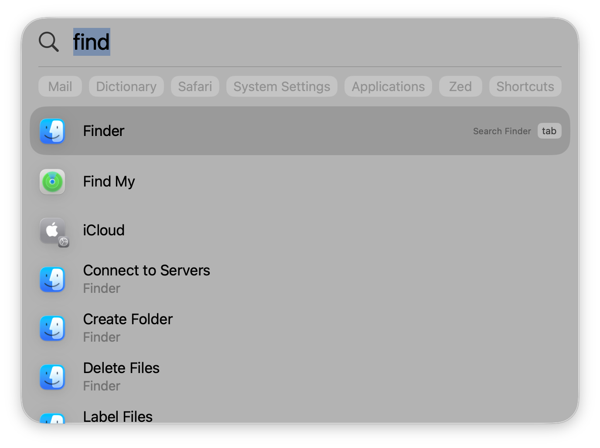
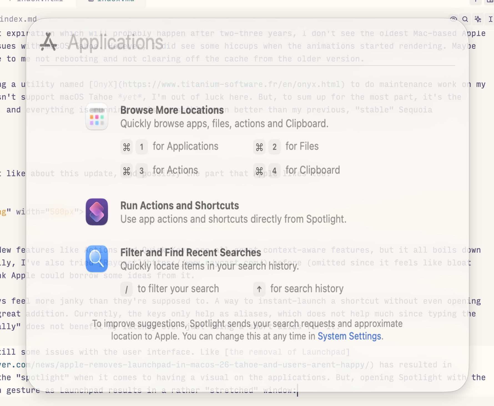
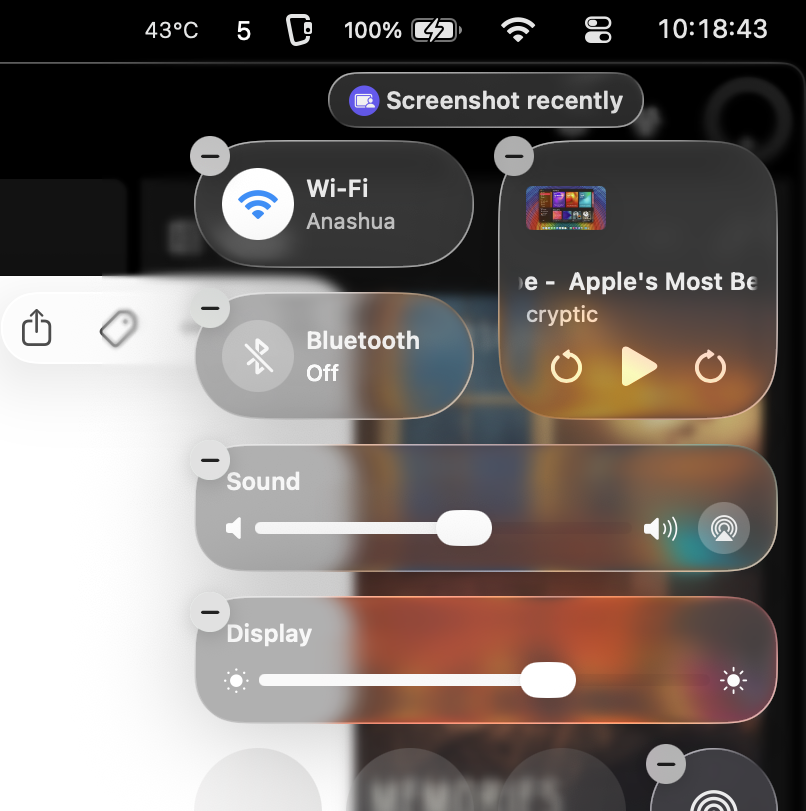
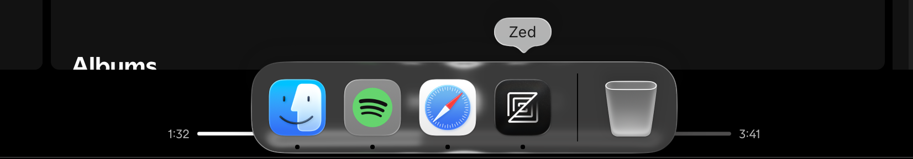
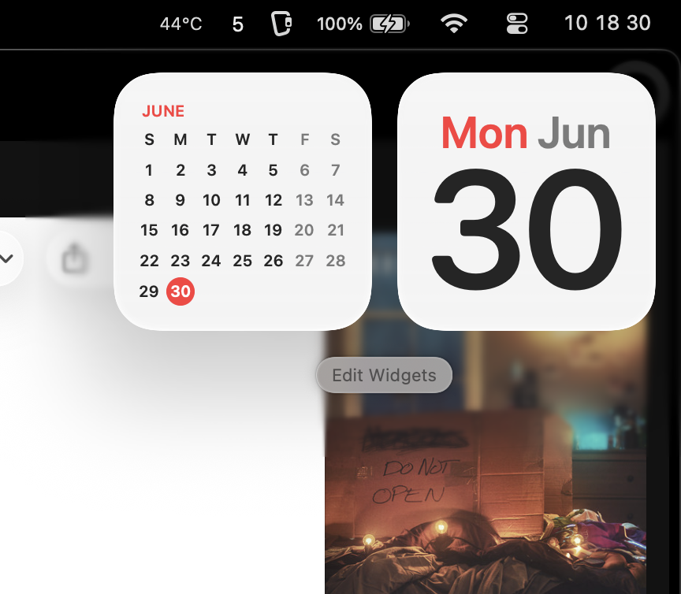

+++
title = "My macOS 26 \"Tahoe\" experience: discussing design quirks & more"
date = 2025-06-30
description = "In this entry, I've elaborated on my thoughts on how \"Liquid Glass\" actually refines the core principles of the hardware-software interactivity on the Macintosh."

[taxonomies]
tags = ["operating-systems", "experiences", "macos"]
+++

So, in a bold move driven by sheer boredom and the urge to try new things, I've decided to install the macOS 26 Tahoe Developer Beta.

This might sound like a little bit of a "downgrade" to my workflow. We all know Apple ships incomplete features which often glitch out a lot, and my development pipeline could've been affected by it. Even I was skeptical of the user experience at first, seeing all the controversy surrounding the "Liquid Glass" refresh macOS has gotten recently. And, to be honest, I think this is all *partially* true?

However, I actually like a couple of things. I still have a lot to say about the design, so I will talk about that during the end.

So, back to the point:

**I, have installed the latest developer beta version of macOS.**

To put a summary at first: It is a design refresh attempt from Apple which, in their wordings, tries to "redefine" what human interactivity with hardware and software looks like.

A "lot" of things got upgraded. Which includes:

- **Apple Intelligence**, but it is still an unfinished product, so it's the topic of a different entry entirely.
- **Live Translation**, which is probably the king feature that Apple's been hyping up since WWDC.
- **Spotlight Search**, and personally, I quite like this one.
- **Design**, which not only includes the Liquid Glass refresh, it also modifies how icons are handled, how window borders look across the board, and so many more things.
- ... and so much more.

### First thoughts

Now, taking into account that even the lowest-end M1 chip still keeps pace with 2025 hardware, I think Apple can truly get some juice out of it by levelling up the UX. As a matter of fact, I'm still using my almost-4-year-old MacBook Air. I hit the save button, which also runs `cargo check`, probably like every twenty seconds while writing code. And, it still doesn't put pressure on the RAM.

So, how well does it perform on Tahoe?

Performance-wise, **I see no major pitfalls at all**, if any.

If not for the support expiration which will probably happen after two-three years, I don't see the oldest Mac-based Apple Silicon having any issues with macOS Tahoe. However, I did see some hiccups when the animations started rendering. Maybe this was partially due to me not rebooting and not clearing off the cache from the older version.

On Sequoia, I was using a utility named [OnyX](https://www.titanium-software.fr/en/onyx.html) to do maintenance work on my Mac. Since it doesn't support macOS Tahoe *yet*, I'm out of luck here. But, to sum up for the most part, it's the second day of writing, and everything is running as-is, possibly even better than my previous, "stable" Sequoia installation.

### Spotlight Search

Okay, the thing I most like about this update, and possibly the part that Apple likes too.

The UI is refreshed. New features like Actions and Quick Keys are all great context-aware features, but it all boils down to the usage. Personally, I've also tried [Raycast](https://www.raycast.com/) before (omitted since it feels like bloat sometimes), and I think Apple could borrow some ideas from it.

Firstly, **the Quick Keys feel more janky than they're supposed to.** A way to instant-launch a shortcut without even opening Spotlight could be a great addition. Currently, the keys only help as aliases, which does not help much since typing the entire command "partially" does not benefit my latency over just using a short alias for it.

Secondly, there are still some issues with the user interface. For example, [the removal of Launchpad](https://www.macobserver.com/news/apple-removes-launchpad-in-macos-26-tahoe-and-users-arent-happy/) has resulted in Spotlight having all the "spotlight" when it comes to having a visual on the applications. But, opening Spotlight with the same four-finger pinch gesture as Launchpad results in a rather "stretched" window:

 

I think these are just little inconvenience for a developer beta that is yet to be matured.

However, performance-wise, I think Spotlight has gotten ***better?*** By better, I mean it's slightly faster when searching for applications. Other than that, I believe the program still has a lot of headroom for improvement, and I really hope Apple fixes it all the while delivering what they promised in WWDC.

### Control Center & others

I love how the Control Center has been redesigned with Liquid Glass. During WWDC, most YouTube channels and critiques highlighted the minor light refractions as a design flaw. After facing a huge amount of backlash, I think Apple has finally listened. Now we have a pretty cute design:

 

And, as you can see in the picture, I've already found a bug with it. During taking screenshots, Control Center recognizes it as edit mode and does not let me take a regular screenshot (hence the '-' button in the corners). But overall, it seems like they have really gotten deep into the design well and thought of display aesthetics with time.

The same can be said about the dock. In my opinion, it looks really pretty. I also love how the new icon design complements the dock's features too. That being said, I will still miss the skeuomorphism design language which had been on macOS for decades. Guess we'll have to play along with rounded edges after all!

 

The only part of the upper area that hasn't been influenced too much by Liquid Glass is probably going to be the Notification Center:

 

And, I really don't have much to talk about it in this case.

### The design language

Now Apple is not new to design, and most of my talks regarding the new update in this entry has been about design so far. So, I'll highlight some of my critical thoughts as promised.

They've really thought about the human interactivity with the software they're about to publish this year.

And by "thought", I mean they've silently managed to create a design language that is both pleasurable to use and addictive. For those who have an obsession towards new designs and blueprints, I think you might have gotten what I'm trying to mention here. If you can couple this new version with enough tweaks of your own, it becomes *physically* harder to resist.

Remember when Steve Jobs announced the first iPhone and everyone was locked-into skeuomorphism and thought Android's plane icons weren't attractive? Looks like Apple is trying to reshape their product line with the exact same principle. Since the new design does not have any hardware performance penalties (rather they have "improvements"), it's a great opportunity for a refresh.

And to me, personally, it feels like Big Sur all over again.

### And... what about Apple Intelligence?

As of today, I've still not used a significant amount (if any) of Apple Intelligence features in my workflow. Currently I've opted myself out since I'm more into using LLMs for labor-intensive tasks than creative things.

### Conclusion

Nice update, overall, I'll have to say. Though, taking in for account the fact that it's still in its primitive stages, makes me feel like Apple can make a ton of more adjustments before it's actually worthy of a proper design-to-performance review.

Thanks for tuning into another *totally not minimally sized* blog entry!
